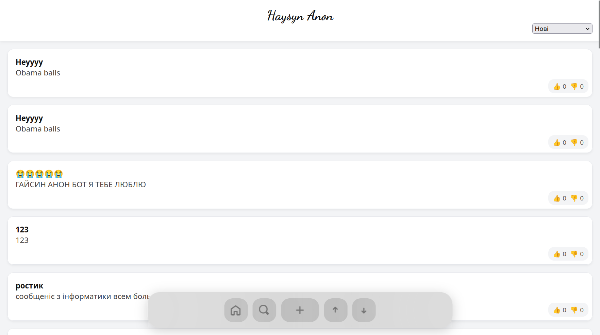
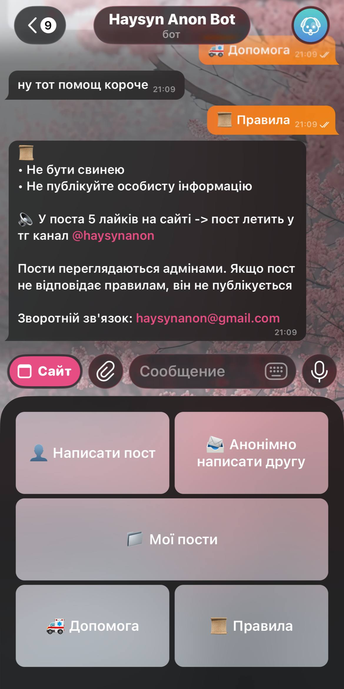
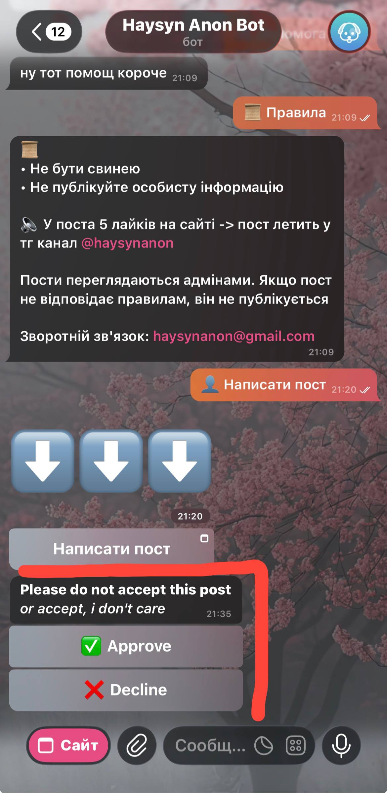

## Haysyn Anon - Moderated (lol) anonymous platform
"Haysyn" in proj name stands for my town name (ofc)

Long story short, for some reason i kinda created a (really poor) Reddit clone, but with no need to create an account. 
- Everything going on a single website, which i didn't manage to host cause I'm fucking poor (for public usage i used ngrok). Post | Read | Comment | Rate posts
- Telegram bot serves as a little helper around that website (with additional features). To not re-implement another frontend and to not fully integrate bot with website API - MiniApp which is basically a button with a link to main website
- Telegram channel is a catalog of 'popular' posts - when post on website reach 5 likes (dumb amount i know) it automatically posts to telegram channel

Website look on desktop (frontend is 'fully' vibe-coded btw), same shi you will have on your phone

## Telegram bot

Telegram bot interface

 - You can enter main website through MiniApp. Everything YOU posted from MiniApp goes into db with your telegram id hashed (i believe), all this to (next point)
 - View your posts (only those, which you posted from MiniApp, cause it`s the only way to identify anon user)
 - Send anonymous messages to your contacts (this feature is fully embraced in my next project https://github.com/cheapdramas/AnonFather)
 - **ADMINS** use bot as the main post moderation source

**ADMINS** part of telegram bot:

 - Approve -> post uploads to website
 - Decline -> post deleted (redis)
 
 
There are several admins, if one of them approves/declines post -> post moderation message disappear  from chats for EVERY admin
## ...This README WIP...
